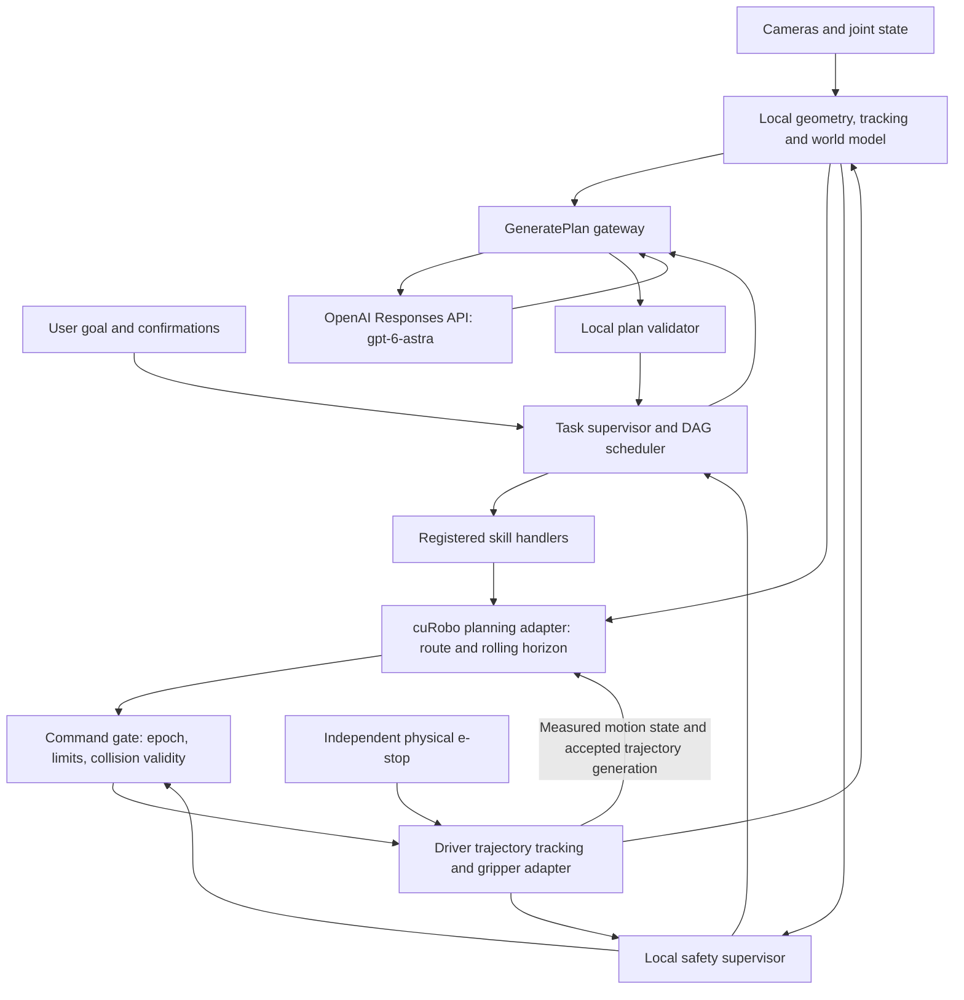

# Architecture

One on-device task supervisor owns a DAG scheduler and a fixed, versioned skill registry. Astra proposes plans; the local system owns all motion and acceptance decisions. Skills express reusable physical interactions. No task-specific Python orchestrator is needed for cabinet versus bottle tasks.

The Jetson runs cameras, local geometry/tracking, world model, gateway, validator, scheduler, skill handlers, cuRobo and the driver. Assume AGX Orin 64 GB MAXN provisionally; thermal/GPU/latency budgets require measurement. ROS 2 executors are not assumed hard real-time. The independent driver watchdog/physical stop must still operate if Python, GPU, networking or the main ROS executor stalls.

Only OpenAI inference is off-device. The local GeneratePlan service is the stable reasoning boundary; GroundTarget provides optional semantic grounding using the same adapter. No remote robot tools, stream callbacks, VLA escape hatch, or provider-specific ROS fields exist.

The local motion path is closed-loop: the active skill executes a validated trajectory portion while cuRobo prepares its continuation from fresh state and target evidence. This supports bounded in-flight route/endpoint corrections without another Astra call. [Performance requirements](14-performance.md) define the proposed rolling adapter, separate trajectory generations, validation and stopping contract. The diagram shows the required architecture; those adapter extensions do not exist yet.

## Interface map

All /rammp interfaces below are NEW project-owned contracts in [interfaces](../../interfaces/). External driver/planner wire names and exact deployment mappings are documented in [the fact sheet](00-interface-fact-sheet.md).

| Path / boundary | Mechanism / type | Producer -> consumer | Cadence |
|---|---|---|---|
| camera role inputs | topics: sensor_msgs/Image and CameraInfo | camera adapters -> world/perception | measured capture rate; timestamp synchronized |
| robot state | driver topics, mapped into local state | driver -> world/safety/skills | actual source rate; watchdog uses age |
| /tf, /tf_static | standard TF topics | calibrated publishers -> geometry | motion-dependent/static |
| /rammp/world/snapshot | service GetWorldSnapshot | world -> validator/gateway/skills | task and dispatch boundaries |
| /rammp/world/state | topic WorldState | world -> supervisor/safety | on revision change and heartbeat |
| /rammp/world/resolve | service ResolveBinding | world -> validator/skills | preflight and dispatch |
| /rammp/world/commit | service CommitEffects | world <- executor | once per verified completion |
| /rammp/reasoning/generate_plan | service GeneratePlan | gateway <- supervisor | task start/replan only |
| /rammp/perception/ground | service GroundTarget | grounding gateway <- observe | held, bounded observation event |
| /rammp/plan/validate | service ValidatePlan | validator <- supervisor | admission and motion dispatch |
| /rammp/execute_skill | action ExecuteSkill | skill server <- scheduler | one action per node |
| /rammp/supervisor/stop | service RequestStop | supervisor <- local clients | event; independent of normal action locks |
| /rammp/safety/status | topic SafetyStatus | supervisor -> all consumers | heartbeat and change |
| /rammp/hri/confirm | service UserConfirm | HRI <- supervisor | before protected action |
| cuRobo adapter | planner action calls / NEW internal rolling extension | planner <- validator/skills | bounded local updates during motion; serialized world/solver access |
| driver adapter | trajectory action / NEW internal validated suffix handoff and gripper command | command gate -> driver | measured/commissioned; rolling support unverified |

Project state/command services use reliable delivery, bounded request deadlines and dedicated callback groups. Safety status is reliable/transient-local for late subscribers. Sensor QoS follows actual camera/driver offers; missing fresh samples causes a hold. Software stop wire QoS must match the driver and is separate from durable safety status.

## Motion and resource boundaries

cuRobo generates arm IK and trajectories. The driver tracks those joint trajectories in a confirmed mode. The current wrapper's transit support does not establish constrained contact, online human tracking, attachment collision or dynamic-world safety. Those require adapter work and tests; the corresponding skills stay unavailable until those capabilities exist.

A single planner instance owns its collision world, GPU cache and serialization lock. Validation artifacts record the exact world, start-state, robot/calibration, attachment and execution epoch used. The command gate rejects mismatches. Avoid validating one path then calling a driver helper that secretly generates another.

The catalog declares only exclusive claims. Camera reads and resident tracking are sensors, not conflicting ownership. Planning/GPU reservations are bounded so they cannot starve safety. Two ready nodes with conflicting claims wait; they do not make the DAG invalid merely because an edge is absent. Conflicting world-state effects require explicit order or rejection.
