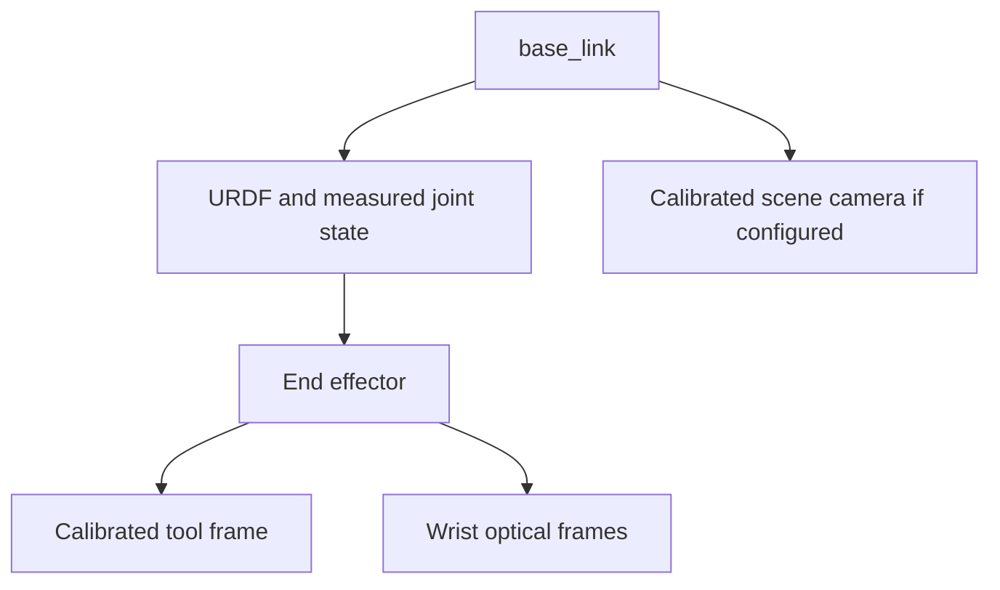

# World model

The local world model supplies Astra's task entities and cuRobo's collision geometry from timestamped evidence. Astra supplies semantic candidates and articulation hypotheses; local geometry estimates and validation decide whether they are usable.

## Frames and calibration

The arm is table-mounted now. Wheelchair mounting is later. The temporary scene camera can be replaced or removed without changing executor contracts.

Transform observations into base_link at capture time. A base-local frame does not imply a stationary environment. Load tool/camera transforms with calibration IDs and uncertainty. Rigid calibrated mounts may use /tf_static; changing transforms need timestamped estimates on /tf. Broadcasting the same calibration repeatedly does not estimate flex or base motion. Exact driver/camera names require deployment mapping.

Moving/removing a camera invalidates its calibration and dependent observations. External base motion invalidates environmental geometry unless a verified localization system transforms it into a new base epoch. A camera rigidly attached to the base need not be recalibrated merely because the base moved. Hold during repositioning and rebuild the scene before resuming.

## Records

| Record | Required local content |
|---|---|
| Entity | Stable ID, label, entity revision, observations/provenance/timestamps, pose and separate position/orientation uncertainty, dimensions, pose roles, validity |
| Articulation | Fitted type/axis/origin, permitted displacement and units, uncertainty, evidence; unknown fields remain unknown |
| Robot/tool | Measured joints, source age, configured TCP, gripper aperture, geometry, attachment transform and uncertainty |
| Person | Head/torso/hands/target landmarks where observable, age/uncertainty, protective volumes |
| Collision snapshot | Conservative obstacles, capture times, immutable snapshot ID, collision revision, robot/tool/attachment/calibration/base identity |
| Fact | Registered predicate, bound entity, evidence source/time, validity and explicit invalidation conditions |

A depth pixel produces a 3D point, not a 6-DoF pose. Use local fitting, multiple correspondences, calibrated models or observed constrained motion for orientation and articulation. Symmetry may leave axes unobservable. Detection centroids are not grasp poses or mouth-delivery targets.

observe reads current views and never moves. A new view requires a separate validated move_to_pose followed by settling. RGB, depth, intrinsics and TF must have compatible capture times. Associate entities using geometry, appearance and uncertainty; ambiguous identity requires clarification or observation, never silent nearest-object rebinding.

The local observation adapter can return pending canonical `MetricPose` records alongside measured evidence. The executor submits both to the sole world writer for one atomic terminal commit: original operation dependencies are checked before any entity/collision revision changes, all pose roles share an exact capture/evidence identity, and a failed batch installs no geometry or facts. Duplicate commits bind the pose payload as well as effects. An observer must not install its new pose first and then retag the operation to bypass a changed dependency. This seam does not provide calibration or infer an unobserved pose.

Local tracking supplies execution and person safety without cloud calls. Optical flow alone does not refresh semantic labels, orientation, articulation or grasp facts. If the scene camera is removed, wrist sensing can substitute only where coverage/range maintain every required observation; otherwise the capability is unavailable.

## Collision and freshness

The pinned wrapper supports cuboid worlds. Its SetWorld accepts a path/name; it has no versioned delta ROS service. The planning adapter must serialize snapshot installation, planning and acknowledgement, retaining the immutable world identity in its result.

Use conservative components that preserve real openings. If the collision cache cannot represent the scene, coalesce conservatively or reject; never drop obstacles to fit capacity. A freely carried object's grasp changes free-object geometry to attached payload geometry only after measured retention evidence. A fixed handle instead creates a constrained grasp relation while door/handle geometry remains articulated world geometry. grasp_state_id versions contact/retention relations separately from the carried attachment_id. Intended contact needs a specific contact allowance; dropping the whole target from collision checking is insufficient.

Entity revisions change relevant estimates/facts. Collision revisions identify planner snapshots. Execution epochs invalidate old commands, validations and confirmations after cancellation or task/ownership replacement. Authorized same-skill trajectory updates instead use distinct monotonic trajectory generations within the active epoch. Calibration/base/attachment identities are dependencies too. New observations need not invalidate unrelated symbolic nodes; changed relevant evidence must invalidate their metric validation. Never retag an old plan with a current version.

Local motion updates use fresh immutable metric snapshots while the arm moves. Revalidate affected executable trajectory and stopping portions against changed evidence; compatible evidence can support a new receipt without restarting the task. If current execution is unsafe, stop immediately; do not wait for replacement planning. Keep pose refinement separate from target identity and task-goal changes. The sole world writer accepts measured tracking/geometry updates during a skill, but predicted endpoints and speculative successor states never become committed success facts. See [rolling motion requirements](14-performance.md).

Stale obstacles remain conservative constraints or cause a stop; stale does not mean absent. Freshness tolerances and uncertainty limits come from commissioned profiles. During motion the full robot and stopping horizon are monitored against current evidence.

## Serialization

[world-context.schema.json](../../schemas/world-context.schema.json) defines the compact reasoning projection, not the entire perception database. Local metric records are represented above and resolved through ResolveBinding. The projection contains stable IDs, available pose roles, valid/unknown facts, capability IDs, human-target availability and revision provenance; no arbitrary expression strings are evaluated.

Only bounded task text, this projection, the catalog-derived grammar and optional task crops leave the device. Raw depth, point clouds, continuous video, joint streams and metric trajectories remain local. Replanning history includes completed nodes and partial/invalidated facts. Pruning must preserve relevant hazards and ambiguity; oversize context produces a reported error instead of silent hazard removal.

The context carries observation age, confidence, separate pose validity and evidence IDs. It also carries a trusted normalized task goal (registered predicate and its complete typed bound args), retained across replans. The gateway cannot change that goal. The initial cabinet example assumes the locally selected open goal is 1.0 rad; a different appliance/profile may select another admissible opening.

The trusted image_id registry retains original RGB/depth capture IDs, intrinsics, TF/calibration, and the exact crop/resize-to-original transform. Grounding boxes are normalized to the transmitted crop; map them through this registry before using aligned depth. Missing/inconsistent provenance invalidates the observation.
