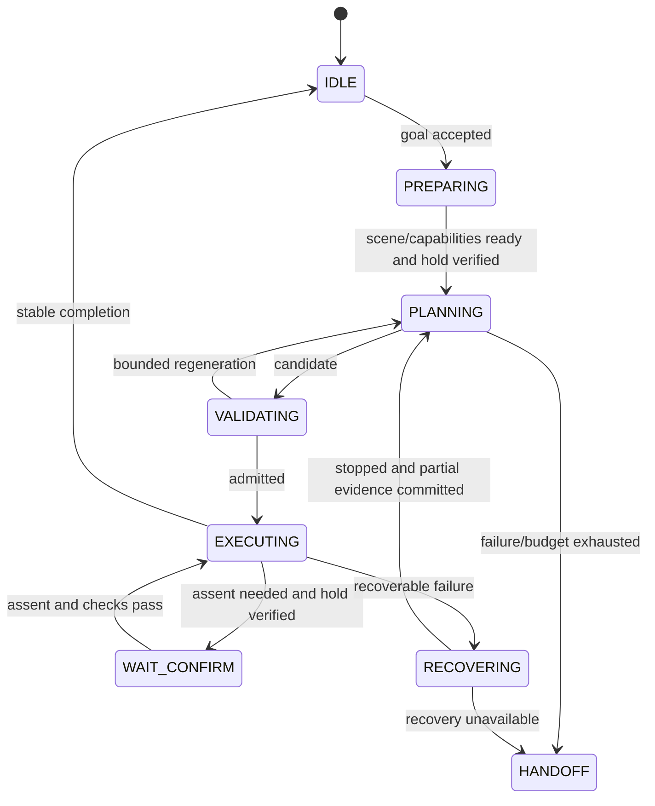

# Execution engine

Use an event-driven DAG scheduler inside a task supervisor state machine. The DAG expresses dependencies and concurrency. The supervisor owns admission, confirmation, stopping, holding, faults and handback. Skills implement bounded physical capabilities behind ExecuteSkill.

Fault stop is reachable from every state independently of the DAG. Stop/hold/confirmation/waits are supervisor operations, never model skills. They remain available with no valid plan. E-stop overrides every operation.

Before cloud requests or confirmation waits, quiesce commands, obtain backend acknowledgement, verify stopped/held state and maintain appropriate retention. Cancellation acknowledgement alone is not proof of zero motion. An uninterruptible GPU planning call may finish later; its obsolete epoch must prevent execution.

## Dispatch and concurrency

Admission validates the whole candidate. Dispatch additionally requires every predecessor's success/effects commit, current typed bindings and predicates, active capabilities, valid confirmation, fresh start state/world/tool/attachment/calibration identities and execution epoch. Acquire the full registry claim set atomically or none.

A ready node that conflicts on claims waits. Disjoint claims are necessary but state compatibility is also required: empty-gripper preshaping may overlap transit only when collision checks cover its whole aperture range. Occupied-gripper release/closure cannot be disguised as preshaping. Plans with conflicting unsequenced state effects are rejected.

Dispatch ready nodes immediately after their evidence and resource gates pass; avoid arbitrary sleeps or repeated initialization between nodes. Local perception and monitoring continue during motion. The active motion handler plans rolling updates using its existing PLANNER claim and retains arm ownership; it does not dispatch another arm node. Preparing a different skill requires the separate planner lease contract in [performance requirements](14-performance.md). Terminal quiescence still applies when a skill actually ends, not at every internal trajectory update.

Rolling updates remain in EXECUTING under the same task/node/attempt/epoch. The command gate accepts only validated atomic trajectory-generation transitions with matching moving-state boundary conditions and relevant current evidence. Every candidate carries its own validation evidence; the original ExecuteSkill admission receipt does not authorize arbitrary replacements. Reject superseded candidates, revoke all candidates on cancellation, and stop before validated continuation is exhausted. The [internal receiver protocol](../../rammp_adl/motion/rolling.py) now has synthetic and MuJoCo joint tests plus an actual cuRobo MPC moving-suffix rehearsal. Physical driver suffix support, generated stopping paths and integration into ADL contact execution remain unavailable; the rehearsal's cancellation escalates explicitly to a simulated actuator hold.

The driver control token belongs to one command gateway/session, not to sibling skills. Old execution epochs are rejected at the final command gate. Token loss is an ownership fault; never seize operator control automatically as a retry.

Motion handlers use cuRobo-generated arm paths. Unavailable constrained planning, guarded contact or human tracking makes the relevant skill unavailable. Missing support is not permission to introduce a task-specific Cartesian controller.

## Results and effects

Skills return result/evidence and propose measured effects. The world model is the sole committer. Use an idempotency key based on task/epoch/node/attempt and compare against the base revision. A duplicate commit returns the original receipt; a changed payload under the same key is rejected.

Process a terminal result in this order: confirm the backend is quiescent, commit measured/partial effects, update node state, then release claims and admit dependents. A success label alone cannot manufacture predicted postconditions. Failure may still leave a moved door or uncertain grasp; record that before recovery.

Only trusted predicate evaluators establish facts. The plan does not contain executable strings, success overrides, claimed limits, or recovery programs. The offline checker tests grammar/graph consistency; runtime physical truth remains the implementation's responsibility.

## Cancellation and recovery

Stop new dispatch, invalidate the command epoch, cancel active goals/streams, and wait for bounded verified stop. Stop timeout escalates to the confirmed driver/hardware stop path. Hold is default; optional retreat is a newly validated motion after trustworthy state and geometry return. A previously clear entry path is not an assured escape route.

Local retries are catalog-bounded, use the same claims, and cannot invent motion. Current catalog allows one no-detection observation retry while stationary; other faults hold then replan or hand off. Changing articulation requires fresh local fit; never flip an axis merely because force increased. Grip loss never opens the gripper in midair or blindly raises force.

After three full task replans, hand back with completed steps, present object state and failure reason. Cloud transport/regeneration budgets and the global request cap are in [reasoning config](../../config/reasoning.json). Refusal, ownership faults and human safety faults are terminal for the current attempt.

Match the driver's reliable/volatile software-stop QoS. Latch safety state locally and publish a separate durable SafetyStatus topic. A ROS stop topic is distinct from the independent physical emergency stop.

Finishing all nodes ends a plan, not automatically the user's task. Evaluate the preserved normalized goal against fresh committed world evidence. A completed observation-only recovery phase requests another bounded plan if the original goal is still unmet; it must never report task success. Terminal task outcomes distinguish success, cancellation, incomplete handback and safety fault.

Concurrent disjoint completions can share a base world revision. On a revision conflict, revalidate the measured effect's dependency set and rebase/commit that effect only; never repeat the completed physical skill. If dependencies conflict, keep the measured evidence, invalidate uncertain facts and replan. In-flight operations are recorded before dispatch. Epoch invalidation revokes commands immediately but allows terminal physical evidence from those registered operations until quiescence and reconciliation; then seal the epoch before admitting another attempt.
