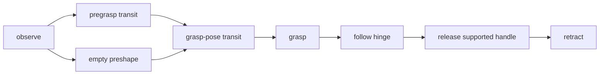

# Trace: open the cabinet door

[Complete plan](../../examples/cabinet.plan.json), [context](../../examples/cabinet.context.json). These fixtures are structurally checked design examples; no geometric feasibility or hardware result is claimed.

Initial evidence: one uniquely associated handle fixed to a supported hinged door; pregrasp/grasp/retract pose roles and an initial local hinge fit; empty gripper; commissioned contact capability assumed for this trace only. The real catalog still marks every handler planned. Pose roles resolve at dispatch into base_link from local calibrated geometry; an Astra box is never the grasp pose.

Initial GeneratePlan occurs while held, before t=0; its configured request deadline is 45 s. t=0 below is whole-plan admission. Durations are estimates, not measured performance. Every row's full typed args are present in the JSON fixture.

| Node | Nominal t, seconds | Skill and all arguments |
|---|---|---|
| c1 | 0-8 | observe(entity_id=cabinet_handle_1, camera=scene, purpose=articulation) |
| c2 | 8-12 | move_to_pose(target={entity_id:cabinet_handle_1, pose_role:pregrasp}, profile_id=sim_transit) |
| c3 | 8-9 | set_gripper(aperture_m=0.06, profile_id=sim_gripper) |
| c4 | 12-16 | move_to_pose(target={entity_id:cabinet_handle_1, pose_role:grasp}, profile_id=sim_transit) |
| c5 | 16-18 | grasp(entity_id=cabinet_handle_1, profile_id=sim_gripper) |
| c6 | 18-24 | follow_constraint(entity_id=cabinet_handle_1, constraint_id=hinge_1, target_value=1.0, target_unit=rad, profile_id=sim_cabinet_contact) |
| c7 | 24-26 | release(entity_id=cabinet_handle_1, support_id=cabinet_door_1, profile_id=sim_gripper) |
| c8 | 26-30 | move_to_pose(target={entity_id:cabinet_handle_1, pose_role:retract}, profile_id=sim_transit) |

c2 claims ARM+PLANNER; c3 claims GRIPPER. Their overlap is valid only with empty-gripper evidence and a trajectory checked over the 0.06 m aperture envelope. c4 waits for both. All other physical nodes serialize. c1 reserves arm/gripper throughout its cloud wait. Catalog timeouts, limits and confirmations are derived locally, absent from model JSON.

At c6, displacement success requires local door-angle evidence near the 1.0 rad goal within the commissioned profile's tolerance. Motion completion or rising effort alone cannot report DoorOpen. The actual door/handle collision geometry and attachment state update as movement occurs.

## Injected model mismatch

Inject unexpected resistance/observed motion inconsistent with hinge_1 at t=19 s, before the door is fully open. Supervisor invalidates execution epoch 1, stops c6 and verifies hold; actual stop latency must meet its measured profile. Preserve grip if supported; no automatic release or hinge sign reversal.

Commit partial door displacement and invalidate the hinge/collision evidence. c7/c8 never run under the old plan. Full replan 1 admits only [cabinet-reobserve](../../examples/cabinet-reobserve.plan.json) using [the invalidated context](../../examples/cabinet-reobserve.context.json): r1=observe(entity_id=cabinet_handle_1, camera=scene, purpose=articulation), nominal 8 s after new admission. This plan performs no arm positioning.

If local geometry cannot fit a supported alternative, hand back. If fresh geometry and continued retention support a corrected hinge, commit a new snapshot. Full replan 2 is [cabinet-resume](../../examples/cabinet-resume.plan.json), with [corrected mock context](../../examples/cabinet-resume.context.json):

| Node | Nominal offset after resume admission | All arguments |
|---|---|---|
| r2 | 0-6 s | follow_constraint(entity_id=cabinet_handle_1, constraint_id=hinge_1, target_value=1.0, target_unit=rad, profile_id=sim_cabinet_contact) |
| r3 | 6-8 s | release(entity_id=cabinet_handle_1, support_id=cabinet_door_1, profile_id=sim_gripper) |
| r4 | 8-12 s | move_to_pose(target={entity_id:cabinet_handle_1, pose_role:retract}, profile_id=sim_transit) |

Edges are r2 -> r3 -> r4. The corrected target is an absolute articulation goal, not an extra 1 rad from the failed endpoint. Revalidate from measured current joints/door state with current attachment and geometry. Two replans have been consumed; neither silently resets the task-wide budget. Cloud time and verified stopping are additional elapsed time, not motion hidden in the nominal table.

Completion commits measured door-open state, supported handle release, gripper-empty state and final retract pose. The user receives actual achieved outcome and any remaining limitation.

The handle grasp is a constrained contact relation (grasp_state_id); the door remains articulated world geometry. It is not a carried attachment. Release readiness is checked at the current supported handle pose, without an invented placement transit.
