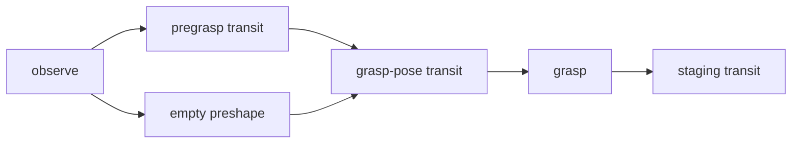

# Trace: pick up the water bottle and stage it

[Complete plan](../../examples/bottle.plan.json), [context](../../examples/bottle.context.json). This is a checked structural fixture, not a live-robot demonstration.

Assumptions: one upright bottle with a registered grasp/retention profile; local pose roles; attached-object collision support. The staging pose is an entity pose role computed locally, not a model output.

The mock sim_bottle_standoff profile illustrates a 0.10 m standoff from the relevant bottle surface, with 0.03 m/s as a simulation-only speed candidate. These are not approved hardware values. Target geometry is computed from the bottle's functional endpoint and attachment transform, not its centroid or the bare TCP.

t=0 is admission after the initial held GeneratePlan call. The only parallel branch is b2/b3 and requires aperture-envelope validation. The plan ends at b6, the staging transit; its at_pose postcondition is the goal. Times are estimates.

| Node | Nominal t, seconds | Skill and all arguments |
|---|---|---|
| b1 | 0-8 | observe(entity_id=bottle_1, camera=scene, purpose=pose) |
| b2 | 8-12 | move_to_pose(target={entity_id:bottle_1, pose_role:pregrasp}, profile_id=sim_transit) |
| b3 | 8-9 | set_gripper(aperture_m=0.075, profile_id=sim_gripper) |
| b4 | 12-16 | move_to_pose(target={entity_id:bottle_1, pose_role:grasp}, profile_id=sim_transit) |
| b5 | 16-18 | grasp(entity_id=bottle_1, profile_id=sim_gripper) |
| b6 | 18-22 | move_to_pose(target={entity_id:bottle_1, pose_role:staging}, profile_id=sim_transit) |

## Injected slip

Recovery is held handback with the bottle state and intervention reason. Do not open the fingers over the table, raise grip force blindly, or continue the transit. If the bottle remains physically supported and a human establishes its state, a later newly authorized attempt starts with fresh observation and validation. A dropped bottle becomes a new free-object hazard; preserving a commanded grip is not reported as successful retention.

This differs from cabinet model-mismatch recovery: uncertain retention is a safety fault and directly hands back instead of spending automatic contact retries. Success in the nominal trace means verified standoff delivery plus local user_done and safe withdrawal; it does not mean the user drank water or the gripper released.
